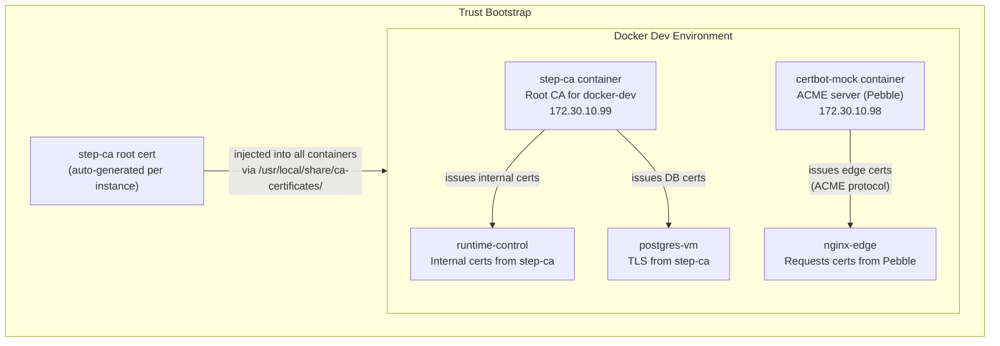

# ADR 0410 — Docker Isolation Testing and IoC Completion

| Field | Value |
|---|---|
| **Status** | Partially Implemented |
| **Date** | 2026-04-11 |
| **Concerns** | testing, IoC, Docker dev, TLS, security |
| **Depends on** | ADR 0387, ADR 0407, ADR 0409 |
| **Implementation** | Phase 1 (subnet isolation), Phase 4a (cert validator), Phase 4c (docker identity) — complete. Phases 2, 3, 4b, 4d, 5 pending. |

## Context

The Docker dev environment (ADR 0387) and the IoC generic-by-default architecture
(ADR 0407/0409) are functional individually but not integrated end-to-end. The
Docker inception test on 2026-04-11 revealed three classes of gaps:

1. **Network isolation**: Docker dev uses 10.10.10.0/24 — the same subnet as
   production. Operators with Tailscale/VPN access cannot run Docker dev without
   route collisions silently sending traffic to production VMs.

2. **TLS/CA in Docker**: step-ca, certbot, and the certificate validator all
   assume real DNS and real certificate chains. Docker dev currently skips or
   self-signs, leaving the TLS layer completely untested.

3. **Single-topology limitation**: Only one Docker dev environment can run at
   a time. Testing permutations (3-service minimal vs 7-service standard vs
   12-service full) requires stopping one before starting another.

Additionally, several IoC edges remain incomplete — the certificate validator
tries to validate `example.com` (the generic committed domain), and some
generator scripts read committed values directly instead of through the
identity overlay.

## Decision

### Phase 1: Subnet Isolation (P0)

Replace the hardcoded 10.10.10.0/24 with a configurable subnet that avoids
production collisions.

```yaml
# docker-dev/minimal/docker-compose.yml (before)
networks:
  serverclaw:
    ipam:
      config:
        - subnet: 10.10.10.0/24
          gateway: 10.10.10.1

# docker-dev/minimal/docker-compose.yml (after)
networks:
  serverclaw:
    ipam:
      config:
        - subnet: ${DOCKER_DEV_SUBNET:-172.30.10.0/24}
          gateway: ${DOCKER_DEV_GATEWAY:-172.30.10.1}
```

Container IP assignments shift correspondingly:

| Container | Production IP | Docker Dev Default |
|-----------|--------------|-------------------|
| nginx-edge | 10.10.10.10 | 172.30.10.10 |
| docker-runtime | 10.10.10.20 | 172.30.10.20 |
| docker-build | 10.10.10.30 | 172.30.10.30 |
| monitoring-vm | 10.10.10.40 | 172.30.10.40 |
| postgres-vm | 10.10.10.50 | 172.30.10.50 |
| backup-vm | 10.10.10.60 | 172.30.10.60 |
| runtime-control | 10.10.10.92 | 172.30.10.92 |

The `inventory/hosts-docker.yml` reads IPs from environment or defaults:

```yaml
all:
  vars:
    docker_dev_base_subnet: "{{ lookup('env', 'DOCKER_DEV_SUBNET') | default('172.30.10', true) }}"
  children:
    lv3_guests:
      hosts:
        nginx-docker:
          ansible_host: "{{ docker_dev_base_subnet }}.10"
        postgres-docker:
          ansible_host: "{{ docker_dev_base_subnet }}.50"
        # ... etc
```

### Phase 2: Parallel Test Topologies (P1)

Enable multiple Docker dev environments to run simultaneously for
permutation testing. Each environment gets its own:
- Docker Compose project name
- Subnet (3rd octet varies)
- Container name prefix
- SSH port range

```
docker-dev/
  profiles/
    minimal.yml         # 3 containers (postgres, control, edge)
    standard.yml        # 7 containers (current full topology)
    extended.yml        # 12 containers (adds dedicated VMs per service)
    micro.yml           # 1 container (all-in-one, fastest feedback)
  instances/
    instance.env.template
```

#### Profile Definitions

**Micro (1 container)** — Fastest feedback loop, ~30s startup:
```
Container: all-in-one (172.30.11.10)
Services: PostgreSQL + Keycloak + Nginx (all in one container)
Purpose: Syntax check, variable resolution, template rendering
RAM: 2 GB
```

**Minimal (3 containers)** — Core services, ~60s startup:
```
Containers: postgres-vm, control-plane, nginx-edge
Services: PostgreSQL, Keycloak, OpenBao, API gateway, Nginx
Purpose: SSO flow, API gateway routing, database operations
RAM: 4 GB
```

**Standard (7 containers)** — Full topology, ~90s startup:
```
Containers: All current Tier 2 containers
Services: All core + build + monitoring + backup
Purpose: Full convergence testing, monitoring stack
RAM: 16 GB
```

**Extended (12 containers)** — Per-service isolation, ~120s startup:
```
Adds: gitea-vm, windmill-vm, dify-vm, minio-vm, matrix-vm
Services: Each major service gets its own container
Purpose: Service interaction testing, failure injection
RAM: 32 GB
```

#### Parallel Instance Manager

```bash
# Launch three environments simultaneously
make docker-test-matrix \
  PROFILES="minimal standard extended" \
  BASE_SUBNETS="172.30.11 172.30.12 172.30.13"

# Each gets its own project name, ports, and subnet:
# minimal:  172.30.11.0/24, ports 9080/9443, project serverclaw-test-minimal
# standard: 172.30.12.0/24, ports 9180/9543, project serverclaw-test-standard
# extended: 172.30.13.0/24, ports 9280/9643, project serverclaw-test-extended
```

Implementation: `scripts/docker_test_matrix.py`

```python
class TestInstance:
    profile: str           # minimal | standard | extended | micro
    subnet: str            # 172.30.XX.0/24
    project_name: str      # serverclaw-test-{profile}
    http_port: int         # host-side HTTP port
    https_port: int        # host-side HTTPS port
    identity_overlay: Path # isolated .local/ copy for this instance
    compose_file: Path     # generated from profile template

class TestMatrix:
    def launch_all(self, profiles: list[str]) -> dict[str, TestInstance]
    def converge_all(self) -> dict[str, ConvergeResult]
    def teardown_all(self) -> None
    def report(self) -> TestMatrixReport
```

### Phase 3: Docker-Native CA and TLS (P1)

Replace the "skip or self-sign" approach with a real certificate chain
inside Docker, using step-ca as the root CA.



#### Components

1. **step-ca in Docker** — Runs as a container in the dev network.
   Auto-generates a root CA on first boot. All other containers trust it.

2. **Pebble (ACME test server)** — Replaces Let's Encrypt for edge
   certificates. Nginx's certbot role switches from real ACME to Pebble
   when `platform_environment == 'docker-dev'`.

3. **Certificate catalog in Docker** — The certificate-catalog.json
   entries get a `docker_dev_issuer` field that maps to step-ca or Pebble
   instead of Let's Encrypt.

4. **Trust injection** — The vm-base Dockerfile includes a volume mount
   at `/usr/local/share/ca-certificates/docker-dev-ca.crt`. The entrypoint
   runs `update-ca-certificates` if the file is present.

```yaml
# Role adaptation for docker-dev mode
- name: Request certificate from ACME
  when: platform_environment != 'docker-dev'
  # ... certbot with Let's Encrypt

- name: Request certificate from Pebble (docker-dev)
  when: platform_environment == 'docker-dev'
  # ... certbot with Pebble at https://172.30.10.98:14000/dir
```

### Phase 4: IoC Completion (P0-P1)

Close remaining gaps in the IoC architecture:

#### 4a. Certificate Validator Identity Awareness (P0)

The pre-push hook's `certificate_validator.py` currently validates against
committed generic domains (`proxmox.example.com`). Fix:

```python
def _resolve_validation_targets(repo_root: Path) -> list[str]:
    """Use .local/identity.yml domain if present, else skip validation."""
    local_identity = repo_root / ".local" / "identity.yml"
    if local_identity.is_file():
        identity = yaml.safe_load(local_identity.read_text())
        domain = identity.get("platform_domain")
        if domain and domain != "example.com":
            return [domain]  # Validate real domain
    return []  # Skip — no real domain to validate
```

#### 4b. Generator Scripts Identity Resolution (P1)

Some generators read committed host_vars directly. They should resolve
through the identity overlay:

| Script | Current Behavior | Target Behavior |
|--------|-----------------|-----------------|
| `generate_platform_vars.py` | Reads committed `203.0.113.1` | Resolves via identity overlay |
| `generate_https_tls_assurance.py` | Reads committed `example.com` | Resolves via identity overlay |
| `generate_slo_rules.py` | Reads committed domains | Resolves via identity overlay |
| `generate_cross_cutting_artifacts.py` | Reads committed values | Resolves via identity overlay |

Common pattern:

```python
from platform.identity import load_identity_overlay

def load_identity_overlay(repo_root: Path) -> dict:
    """Merge committed identity.yml with .local/identity.yml overrides."""
    committed = yaml.safe_load((repo_root / "inventory/group_vars/all/identity.yml").read_text())
    local_path = repo_root / ".local" / "identity.yml"
    if local_path.is_file():
        local = yaml.safe_load(local_path.read_text())
        committed.update(local)  # Local values win
    return committed
```

#### 4c. Docker Inventory Identity Injection (P1)

The `hosts-docker.yml` should automatically source identity values:

```yaml
all:
  vars:
    # Identity injection for Docker dev
    platform_domain: "{{ lookup('env', 'PLATFORM_DOMAIN') | default('docker-dev.local', true) }}"
    platform_operator_email: "{{ lookup('env', 'PLATFORM_OPERATOR_EMAIL') | default('operator@docker-dev.local', true) }}"
```

#### 4d. DNS Resolution in Docker (P2)

Add CoreDNS container to Docker dev for split-horizon DNS:

```
*.docker-dev.local → nginx-edge container (172.30.10.10)
step-ca.docker-dev.local → step-ca container (172.30.10.99)
```

This enables services to resolve each other by FQDN, matching production
behavior where all services use `*.example.com`.

### Phase 5: Test Scenarios and Timing (P2)

#### Convergence Time Estimates

| Profile | Containers | Services | Est. Converge Time | RAM |
|---------|-----------|----------|-------------------|-----|
| Micro | 1 | 3 | 2-5 min | 2 GB |
| Minimal | 3 | 8 | 5-10 min | 4 GB |
| Standard | 7 | 25 | 15-25 min | 16 GB |
| Extended | 12 | 45 | 25-40 min | 32 GB |

#### Permutation Test Matrix

```yaml
# config/docker-test-scenarios.yml
scenarios:
  smoke:
    profile: micro
    services: [postgres, keycloak, nginx]
    validates: [variable-resolution, template-rendering]
    timeout: 300

  sso-flow:
    profile: minimal
    services: [postgres, keycloak, nginx, api-gateway, oauth2-proxy]
    validates: [oidc-login, token-refresh, session-management]
    timeout: 600

  full-stack:
    profile: standard
    services: all
    validates: [convergence, service-discovery, monitoring]
    timeout: 1800

  tls-chain:
    profile: minimal
    extra_containers: [step-ca, pebble]
    services: [postgres, keycloak, nginx, step-ca]
    validates: [cert-issuance, cert-renewal, trust-chain]
    timeout: 900

  failover:
    profile: standard
    services: all
    validates: [postgres-failover, service-restart, health-recovery]
    timeout: 1200
    destructive: true

  multi-domain:
    profile: minimal
    instances: 2
    identities:
      - {platform_domain: alpha.test, subnet: "172.30.20"}
      - {platform_domain: beta.test, subnet: "172.30.21"}
    validates: [identity-isolation, no-cross-contamination]
    timeout: 1200
```

#### CI Integration

```yaml
# .gitea/workflows/docker-matrix.yml
name: Docker Test Matrix
on:
  push:
    branches: [main]
  schedule:
    - cron: '0 2 * * 1'  # Weekly Monday 2am

jobs:
  smoke:
    runs-on: self-hosted
    steps:
      - run: make docker-test SCENARIO=smoke

  sso:
    runs-on: self-hosted
    needs: smoke
    steps:
      - run: make docker-test SCENARIO=sso-flow

  full:
    runs-on: self-hosted
    needs: sso
    steps:
      - run: make docker-test SCENARIO=full-stack
```

## Implementation Plan

| Phase | Priority | Effort | Description |
|-------|----------|--------|-------------|
| 1 — Subnet isolation | P0 | 2h | Change subnet, update compose + inventory + Makefile + verify |
| 4a — Cert validator fix | P0 | 1h | Skip example.com in pre-push certificate validation |
| 2 — Parallel profiles | P1 | 8h | Profile system, instance manager, port allocation |
| 3 — Docker CA/TLS | P1 | 12h | step-ca container, Pebble, trust injection, role adaptation |
| 4b — Generator identity | P1 | 4h | `load_identity_overlay()` in 5 generator scripts |
| 4c — Docker identity | P1 | 2h | Environment-based identity in hosts-docker.yml |
| 5 — Test scenarios | P2 | 8h | Scenario catalog, matrix runner, CI workflow |
| 4d — Docker DNS | P2 | 4h | CoreDNS container, split-horizon config |

**Total estimated effort**: ~41 hours across 8 work items

## Consequences

### Positive

- **No production collision**: Docker dev environments use a completely
  different subnet, safe to run alongside Tailscale/VPN.
- **Real TLS testing**: Certificate issuance, renewal, and trust chains
  are tested in Docker, catching issues before production deployment.
- **Permutation testing**: Test 3-service vs 7-service vs 12-service
  configurations simultaneously, measuring convergence times and
  catching topology-dependent bugs.
- **Multi-domain testing**: Run two instances with different identities
  to verify IoC isolation — proving that the 8-value edit truly
  produces independent deployments.
- **CI-ready**: Scenarios can run in Gitea CI for automated regression
  testing without needing real Hetzner servers.

### Negative

- **Docker Desktop resource pressure**: Extended profile needs 32 GB RAM.
  Parallel instances multiply this. Developers with <16 GB RAM are
  limited to micro/minimal profiles.
- **Behavioral differences remain**: Docker containers are not VMs.
  systemd, kernel modules, and hardware-level features cannot be tested.
  The KNOWN-DIFFERENCES.md list grows with each new feature.
- **Maintenance burden**: Each new service requires updating 4 profile
  compose files, the inventory, and the scenario catalog.
- **Pebble is not Let's Encrypt**: Some edge cases in ACME certificate
  issuance may behave differently with Pebble vs the real ACME server.

### Risk Mitigation

| Risk | Mitigation |
|------|-----------|
| Port exhaustion with many instances | Port allocation registry in instance manager |
| Docker Desktop memory limits | Profile-specific resource limits in compose files |
| Subnet collision with other Docker networks | Use 172.30.x.0/24 range (uncommon) |
| step-ca root CA compromise in dev | Root CA is ephemeral, regenerated per instance |
| Test scenarios becoming stale | Scenario validation in pre-commit hook |
