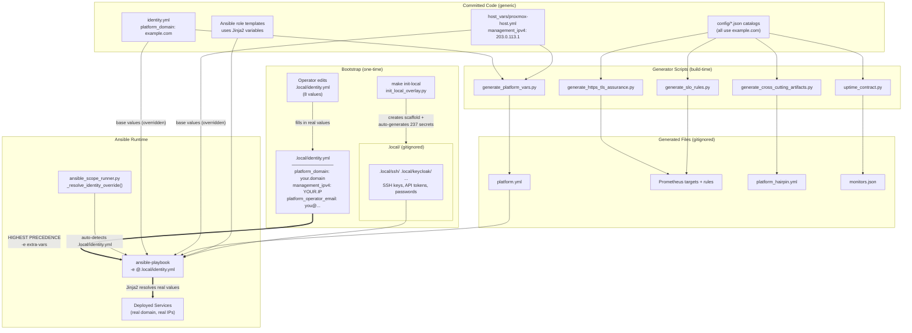
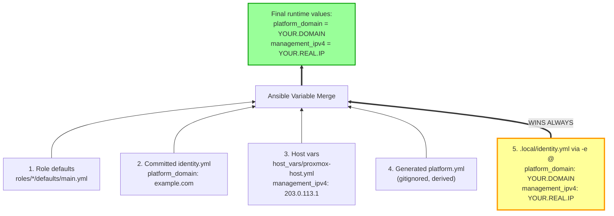
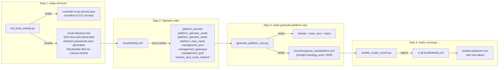
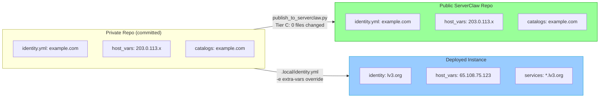

# Inversion of Control — Value Flow Architecture

> **ADR 0407 / 0409** — How deployment-specific values flow from `.local/identity.yml`
> into the running system. Committed code is fully generic (`example.com`).

## 1. End-to-End Value Flow



## 2. Ansible Variable Precedence

The key insight: `.local/identity.yml` is injected via `-e @` extra-vars,
which have the **absolute highest** precedence in Ansible's 22-level hierarchy.



## 3. Bootstrap Sequence

What an operator runs after cloning — 3 scripts set up everything:



## 4. The 8 Values That Control Everything

| Variable | What It Controls |
|----------|-----------------|
| `platform_domain` | ALL 60+ service FQDNs, TLS certs, DNS zone, Keycloak realm, mail domain |
| `platform_operator_email` | ACME certs, alert recipients, mail sender |
| `platform_operator_name` | Proxmox admin comment, notification author |
| `platform_repo_name` | Server checkout path, Gitea repo reference |
| `management_ipv4` | Public IP for DNS A records, firewall rules |
| `management_gateway4` | Network route for outbound traffic |
| `management_ipv6` | Public IPv6 for DNS AAAA records |
| `hetzner_ipv4_route_network` | Hetzner route for additional IPs |

The `platform_domain` value alone derives 60+ downstream variables:

```
platform_domain: acme.corp
    keycloak_realm_name: acme
    keycloak_oidc_issuer_url: https://sso.acme.corp/realms/acme
    hetzner_dns_zone_name: acme.corp
    platform_container_registry: registry.acme.corp
    mail_platform_domain: acme.corp
    proxmox_acme_domain: proxmox.acme.corp
    searxng_controller_url: http://search.acme.corp
    serverclaw_public_url: https://chat.acme.corp
    ...
```

## 5. Publication Pipeline (Zero Sanitization)

After ADR 0409, the committed code and public repo are identical:


