# Service Interaction Map

A mermaid view of the platform organized by candidate **profile buckets**.
Use this to decide which services group naturally into deployment profiles
(minimal, identity, observability, AI, dev, collab, full, etc.).

Edges only show *shared platform dependencies* (auth, DB, secrets, edge,
event bus, LLM). Per-service internal wiring is omitted to keep the graph
readable.

```mermaid
flowchart LR

%% ============ CORE SHARED PLATFORM ============
subgraph CORE["Core platform (always-on)"]
  direction TB
  NGINX[nginx_runtime<br/>edge TLS / reverse proxy]
  OAUTH[oauth2-proxy<br/>shared auth front]
  KC[Keycloak<br/>OIDC / SSO]
  BAO[OpenBao<br/>secrets / PKI]
  STEPCA[step-ca<br/>X.509 certs]
  PG[(Postgres<br/>primary)]
  PGR[(Postgres replica)]
  REDIS[(Redis)]
  MINIO[(MinIO<br/>S3)]
  NATS[NATS JetStream<br/>event bus]
  REDPANDA[Redpanda<br/>Kafka API]
  HEAD[Headscale VPN]
end

%% ============ OBSERVABILITY ============
subgraph OBS["Observability profile"]
  direction TB
  PROM[Prometheus]
  LOKI[Loki]
  TEMPO[Tempo]
  GRAF[Grafana]
  AM[Alertmanager]
  FALCO[Falco]
  FALCOBR[Falco event bridge]
  NTOP[ntopng]
  UPK[Uptime Kuma]
  GLITCH[GlitchTip<br/>error tracking]
end

%% ============ DEV / CI / CD ============
subgraph DEV["Dev / CI profile"]
  direction TB
  GITEA[Gitea]
  WOOD[Woodpecker CI]
  HARBOR[Harbor registry]
  RENOV[Renovate]
  SEMA[Semaphore]
  ARTC[Artifact cache]
end

%% ============ AI / LLM ============
subgraph AI["AI / LLM profile"]
  direction TB
  OLLAMA[Ollama]
  DIFY[Dify]
  LITE[LiteLLM]
  LIBR[LibreChat]
  OWUI[Open WebUI]
  LF[Langfuse]
  RAG[rag_context<br/>+ Qdrant]
  TIKA[Tika]
  GOTEN[Gotenberg]
  TESS[Tesseract OCR]
  PIPER[Piper TTS]
  CRAWL[Crawl4AI]
  BROWSER[browser_runner]
end

%% ============ KNOWLEDGE / COLLAB ============
subgraph COLLAB["Knowledge & collab profile"]
  direction TB
  OUTLINE[Outline wiki]
  PLANE[Plane]
  MATTER[Mattermost]
  MATRIX[Matrix Synapse]
  VIK[Vikunja]
  LIVEKIT[LiveKit]
  EXC[Excalidraw]
end

%% ============ DOCS / CMS / DATA ============
subgraph DOCS["Docs / CMS / data profile"]
  direction TB
  PAPER[Paperless]
  NEXT[Nextcloud]
  GRIST[Grist]
  DIRECT[Directus]
  LABEL[Label Studio]
  SFTP[SFTPGo]
  SUPER[Superset]
  PLAUS[Plausible]
end

%% ============ AUTOMATION / WORKFLOW ============
subgraph AUTO["Automation profile"]
  direction TB
  N8N[n8n]
  WIND[Windmill]
  TEMP[Temporal]
  CHANGE[ChangeDetection]
  NTFY[ntfy]
end

%% ============ PLATFORM / OPS ============
subgraph OPS["Platform / ops profile"]
  direction TB
  APIGW[api_gateway]
  OPSP[ops_portal]
  REPOI[repo_intake]
  HOME[Homepage]
  PORTA[Portainer]
  DOZZLE[Dozzle]
  NETBOX[NetBox]
  MAILP[mail_platform<br/>Stalwart]
  MAILPIT[Mailpit]
  COOL[Coolify]
  OPENFGA[OpenFGA]
  VW[Vaultwarden]
  SEARX[SearXNG]
  FLAG[Flagsmith]
  LAGO[Lago]
end

%% ============ EDGE: every public service hits nginx ============
NGINX --> OAUTH
OAUTH --> KC

%% ---- SSO clients (direct OIDC to Keycloak) ----
KC -. OIDC .-> GITEA
KC -. OIDC .-> HARBOR
KC -. OIDC .-> GRAF
KC -. OIDC .-> OUTLINE
KC -. OIDC .-> PLANE
KC -. OIDC .-> MATTER
KC -. OIDC .-> MATRIX
KC -. OIDC .-> NEXT
KC -. OIDC .-> DIRECT
KC -. OIDC .-> PAPER
KC -. OIDC .-> SUPER
KC -. OIDC .-> VIK
KC -. OIDC .-> VW
KC -. OIDC .-> DIFY
KC -. OIDC .-> LF
KC -. OIDC .-> APIGW
KC -. OIDC .-> OPSP
KC -. OIDC .-> REPOI
KC -. OIDC .-> GLITCH
KC -. OIDC .-> GRIST
KC -. OIDC .-> MAILP

%% ---- OAuth2-proxy fronted (no native OIDC) ----
OAUTH -. fronts .-> N8N
OAUTH -. fronts .-> WIND
OAUTH -. fronts .-> LABEL
OAUTH -. fronts .-> EXC
OAUTH -. fronts .-> FLAG
OAUTH -. fronts .-> LAGO
OAUTH -. fronts .-> PLAUS
OAUTH -. fronts .-> HOME
OAUTH -. fronts .-> COOL
OAUTH -. fronts .-> DOZZLE

%% ---- Postgres clients ----
PG --> KC
PG --> GITEA
PG --> HARBOR
PG --> OUTLINE
PG --> PLANE
PG --> MATTER
PG --> MATRIX
PG --> NEXT
PG --> DIRECT
PG --> PAPER
PG --> VIK
PG --> VW
PG --> DIFY
PG --> LF
PG --> LITE
PG --> SUPER
PG --> N8N
PG --> WIND
PG --> TEMP
PG --> SEMA
PG --> NETBOX
PG --> SFTP
PG --> LABEL
PG --> GLITCH
PG --> FLAG
PG --> LAGO
PG --> OPENFGA
PG --> PLAUS
PG --> PGR

%% ---- Secrets / PKI ----
BAO -. secrets .-> KC
BAO -. secrets .-> DIFY
BAO -. secrets .-> OUTLINE
BAO -. secrets .-> LF
BAO -. secrets .-> GRIST
BAO -. secrets .-> DIRECT
BAO -. secrets .-> PAPER
BAO -. secrets .-> LABEL
BAO -. secrets .-> RAG
BAO -. secrets .-> MAILP
BAO -. secrets .-> FLAG
STEPCA --> NGINX
STEPCA --> BAO

%% ---- Object storage ----
MINIO --> DIFY
MINIO --> OUTLINE
MINIO --> NEXT
MINIO --> PAPER
MINIO --> MATTER
MINIO --> LF
MINIO --> HARBOR

%% ---- Cache ----
REDIS --> DIFY
REDIS --> OUTLINE
REDIS --> MATTER
REDIS --> NEXT
REDIS --> PLANE
REDIS --> LF

%% ---- Event bus ----
NATS --> APIGW
NATS --> OPSP
NATS --> WIND
NATS --> FALCOBR
REDPANDA --> LF

%% ---- LLM fan-in ----
OLLAMA --> DIFY
OLLAMA --> LIBR
OLLAMA --> OWUI
OLLAMA --> RAG
LITE --> LIBR
LITE --> DIFY
DIFY --> LF
LIBR --> LF
LITE --> LF

%% ---- Doc / OCR pipeline ----
TIKA --> PAPER
GOTEN --> PAPER
TESS --> PAPER
CRAWL --> RAG
BROWSER --> CRAWL

%% ---- CI / CD pipeline ----
GITEA --> WOOD
WOOD --> HARBOR
HARBOR --> COOL
RENOV --> GITEA

%% ---- Observability fan-in ----
PROM --> GRAF
LOKI --> GRAF
TEMPO --> GRAF
PROM --> AM
FALCO --> FALCOBR
FALCOBR --> AM
AM --> MAILP
AM --> NTFY

%% ---- Mail ----
MAILP --> AM
MAILP --> PLANE
MAILP --> MATTER
MAILP --> GRAF

%% ---- VPN / edge ----
HEAD -. wg mesh .- NGINX

classDef core fill:#1f3a5f,stroke:#5b9bd5,color:#fff
classDef obs fill:#3b3b1f,stroke:#d5c95b,color:#fff
classDef dev fill:#1f3b2a,stroke:#5bd58a,color:#fff
classDef ai  fill:#3b1f3b,stroke:#d55bd5,color:#fff
classDef col fill:#3b2a1f,stroke:#d5905b,color:#fff
classDef doc fill:#1f3b3b,stroke:#5bd5d5,color:#fff
classDef aut fill:#2a1f3b,stroke:#905bd5,color:#fff
classDef ops fill:#3b1f2a,stroke:#d55b90,color:#fff

class NGINX,OAUTH,KC,BAO,STEPCA,PG,PGR,REDIS,MINIO,NATS,REDPANDA,HEAD core
class PROM,LOKI,TEMPO,GRAF,AM,FALCO,FALCOBR,NTOP,UPK,GLITCH obs
class GITEA,WOOD,HARBOR,RENOV,SEMA,ARTC dev
class OLLAMA,DIFY,LITE,LIBR,OWUI,LF,RAG,TIKA,GOTEN,TESS,PIPER,CRAWL,BROWSER ai
class OUTLINE,PLANE,MATTER,MATRIX,VIK,LIVEKIT,EXC col
class PAPER,NEXT,GRIST,DIRECT,LABEL,SFTP,SUPER,PLAUS doc
class N8N,WIND,TEMP,CHANGE,NTFY aut
class APIGW,OPSP,REPOI,HOME,PORTA,DOZZLE,NETBOX,MAILP,MAILPIT,COOL,OPENFGA,VW,SEARX,FLAG,LAGO ops
```

## Suggested profile buckets

| Profile | Includes | Hard deps it pulls in |
|---|---|---|
| **base** | nginx, oauth2-proxy, Keycloak, OpenBao, step-ca, Postgres, Redis, MinIO, NATS, Headscale | — |
| **observability** | Prometheus, Loki, Tempo, Grafana, Alertmanager, Falco, Uptime Kuma, GlitchTip | base + mail_platform |
| **dev** | Gitea, Woodpecker, Harbor, Renovate, Semaphore, artifact_cache | base + Postgres + MinIO |
| **ai** | Ollama, Dify, LiteLLM, LibreChat, Open WebUI, Langfuse, rag_context, Tika, Gotenberg, Tesseract, Piper, Crawl4AI, browser_runner | base + Postgres + MinIO + Redpanda |
| **collab** | Outline, Plane, Mattermost, Matrix, Vikunja, LiveKit, Excalidraw | base + Postgres + Redis + MinIO |
| **docs** | Paperless, Nextcloud, Grist, Directus, Label Studio, SFTPGo, Superset, Plausible | base + Postgres + MinIO + Tika/Gotenberg/Tesseract |
| **automation** | n8n, Windmill, Temporal, ChangeDetection, ntfy | base + Postgres |
| **ops** | api_gateway, ops_portal, repo_intake, Homepage, Portainer, Dozzle, NetBox, mail_platform, Mailpit, Coolify, OpenFGA, Vaultwarden, SearXNG, Flagsmith, Lago | base |
| **full** | all of the above | — |

The dotted edges in the diagram are the cross-profile coupling points —
those are the seams to formalize when you carve profiles apart.
