# Service Dependency Graph

Generated from `config/dependency-graph.json`.

## Recovery Tiers

| Tier | Services |
| --- | --- |
| `1` | Alertmanager, Docker Build VM, Docker Runtime VM, Grafana, Headscale, Mail Platform, NGINX Edge, Ollama, OpenBao, Platform Context API, Portainer, Postgres, Proxmox Backup Server, Proxmox UI, Uptime Kuma, ntfy, ntopng, step-ca |
| `2` | Changelog Portal, Developer Portal, Gitea, Keycloak, Langfuse, Mattermost, NetBox, Open WebUI, Public Status Page, Semaphore, Vaultwarden, Windmill, n8n |
| `3` | Homepage, Platform API Gateway |
| `4` | Ops Portal |

## Mermaid Diagram

```mermaid
graph TD
    alertmanager["Alertmanager\nTier 1"]
    docker_build["Docker Build VM\nTier 1"]
    docker_runtime["Docker Runtime VM\nTier 1"]
    grafana["Grafana\nTier 1"]
    headscale["Headscale\nTier 1"]
    mail_platform["Mail Platform\nTier 1"]
    nginx_edge["NGINX Edge\nTier 1"]
    ntfy["ntfy\nTier 1"]
    ntopng["ntopng\nTier 1"]
    ollama["Ollama\nTier 1"]
    openbao["OpenBao\nTier 1"]
    platform_context_api["Platform Context API\nTier 1"]
    portainer["Portainer\nTier 1"]
    postgres["Postgres\nTier 1"]
    backup_pbs["Proxmox Backup Server\nTier 1"]
    proxmox_ui["Proxmox UI\nTier 1"]
    step_ca["step-ca\nTier 1"]
    uptime_kuma["Uptime Kuma\nTier 1"]
    changelog_portal["Changelog Portal\nTier 2"]
    docs_portal["Developer Portal\nTier 2"]
    gitea["Gitea\nTier 2"]
    keycloak["Keycloak\nTier 2"]
    langfuse["Langfuse\nTier 2"]
    mattermost["Mattermost\nTier 2"]
    n8n["n8n\nTier 2"]
    netbox["NetBox\nTier 2"]
    open_webui["Open WebUI\nTier 2"]
    status_page["Public Status Page\nTier 2"]
    semaphore["Semaphore\nTier 2"]
    vaultwarden["Vaultwarden\nTier 2"]
    windmill["Windmill\nTier 2"]
    homepage["Homepage\nTier 3"]
    api_gateway["Platform API Gateway\nTier 3"]
    ops_portal["Ops Portal\nTier 4"]
    alertmanager -->|soft| mattermost
    alertmanager -->|soft| ntfy
    api_gateway -->|hard| keycloak
    api_gateway -->|soft| nginx_edge
    changelog_portal -->|hard| nginx_edge
    docs_portal -->|hard| nginx_edge
    gitea -->|soft| docker_build
    gitea -->|soft| keycloak
    gitea -->|startup_only| openbao
    gitea -->|hard| postgres
    grafana -->|soft| keycloak
    grafana -->|soft| nginx_edge
    headscale -->|soft| nginx_edge
    homepage -->|hard| keycloak
    homepage -->|hard| nginx_edge
    keycloak -->|soft| nginx_edge
    keycloak -->|startup_only| openbao
    keycloak -->|hard| postgres
    keycloak -->|startup_only| step_ca
    langfuse -->|soft| keycloak
    langfuse -->|soft| nginx_edge
    langfuse -->|startup_only| openbao
    langfuse -->|hard| postgres
    mail_platform -->|soft| nginx_edge
    mail_platform -->|startup_only| openbao
    mattermost -->|startup_only| openbao
    mattermost -->|hard| postgres
    n8n -->|soft| keycloak
    n8n -->|soft| nginx_edge
    n8n -->|startup_only| openbao
    n8n -->|hard| postgres
    netbox -->|startup_only| openbao
    netbox -->|hard| postgres
    open_webui -->|soft| keycloak
    open_webui -->|hard| ollama
    open_webui -->|startup_only| openbao
    ops_portal -->|hard| api_gateway
    ops_portal -->|hard| keycloak
    ops_portal -->|hard| nginx_edge
    platform_context_api -->|startup_only| openbao
    platform_context_api -->|reads_from| step_ca
    semaphore -->|startup_only| openbao
    semaphore -->|hard| postgres
    status_page -->|hard| nginx_edge
    status_page -->|hard| uptime_kuma
    vaultwarden -->|hard| postgres
    vaultwarden -->|startup_only| step_ca
    windmill -->|startup_only| openbao
    windmill -->|hard| postgres
```

