!!! note "Sensitivity: INTERNAL"
    This page is intended for authenticated operators and internal collaborators.

# Service Dependency Graph

Generated from `config/dependency-graph.json`.

## Recovery Tiers

| Tier | Services |
| --- | --- |
| `1` | Alertmanager, Coolify, Docker Build VM, Docker Runtime VM, Dozzle, Grafana, Harbor, Headscale, Mail Platform, Mailpit, NATS JetStream, NGINX Edge, Netdata Realtime Metrics, Nomad, Ollama, OpenBao, Platform Context API, Portainer, Postgres, Proxmox Backup Server, Proxmox UI, SearXNG, Uptime Kuma, ntfy, ntopng, step-ca |
| `2` | Apache Tika, Browser Runner, Changedetection.io, Changelog Portal, Coolify Apps Ingress, Developer Portal, Dify, Directus, Excalidraw, Gitea, Gotenberg, Keycloak, Langfuse, Matrix Synapse, Mattermost, NetBox, Nextcloud, Open WebUI, OpenFGA, Outline, Plane, Plausible Analytics, Public Status Page, Semaphore, ServerClaw, Tesseract OCR, Vaultwarden, Windmill, n8n |
| `3` | Homepage, Platform API Gateway |
| `4` | Ops Portal |

## Mermaid Diagram

```mermaid
graph TD
    alertmanager["Alertmanager\nTier 1"]
    coolify["Coolify\nTier 1"]
    docker_build["Docker Build VM\nTier 1"]
    docker_runtime["Docker Runtime VM\nTier 1"]
    dozzle["Dozzle\nTier 1"]
    grafana["Grafana\nTier 1"]
    harbor["Harbor\nTier 1"]
    headscale["Headscale\nTier 1"]
    mail_platform["Mail Platform\nTier 1"]
    mailpit["Mailpit\nTier 1"]
    nats_jetstream["NATS JetStream\nTier 1"]
    realtime["Netdata Realtime Metrics\nTier 1"]
    nginx_edge["NGINX Edge\nTier 1"]
    nomad["Nomad\nTier 1"]
    ntfy["ntfy\nTier 1"]
    ntopng["ntopng\nTier 1"]
    ollama["Ollama\nTier 1"]
    openbao["OpenBao\nTier 1"]
    platform_context_api["Platform Context API\nTier 1"]
    portainer["Portainer\nTier 1"]
    postgres["Postgres\nTier 1"]
    backup_pbs["Proxmox Backup Server\nTier 1"]
    proxmox_ui["Proxmox UI\nTier 1"]
    searxng["SearXNG\nTier 1"]
    step_ca["step-ca\nTier 1"]
    uptime_kuma["Uptime Kuma\nTier 1"]
    tika["Apache Tika\nTier 2"]
    browser_runner["Browser Runner\nTier 2"]
    changedetection["Changedetection.io\nTier 2"]
    changelog_portal["Changelog Portal\nTier 2"]
    coolify_apps["Coolify Apps Ingress\nTier 2"]
    docs_portal["Developer Portal\nTier 2"]
    dify["Dify\nTier 2"]
    directus["Directus\nTier 2"]
    excalidraw["Excalidraw\nTier 2"]
    gitea["Gitea\nTier 2"]
    gotenberg["Gotenberg\nTier 2"]
    keycloak["Keycloak\nTier 2"]
    langfuse["Langfuse\nTier 2"]
    matrix_synapse["Matrix Synapse\nTier 2"]
    mattermost["Mattermost\nTier 2"]
    n8n["n8n\nTier 2"]
    netbox["NetBox\nTier 2"]
    nextcloud["Nextcloud\nTier 2"]
    open_webui["Open WebUI\nTier 2"]
    openfga["OpenFGA\nTier 2"]
    outline["Outline\nTier 2"]
    plane["Plane\nTier 2"]
    plausible["Plausible Analytics\nTier 2"]
    status_page["Public Status Page\nTier 2"]
    semaphore["Semaphore\nTier 2"]
    serverclaw["ServerClaw\nTier 2"]
    tesseract_ocr["Tesseract OCR\nTier 2"]
    vaultwarden["Vaultwarden\nTier 2"]
    windmill["Windmill\nTier 2"]
    homepage["Homepage\nTier 3"]
    api_gateway["Platform API Gateway\nTier 3"]
    ops_portal["Ops Portal\nTier 4"]
    alertmanager -->|soft| mattermost
    alertmanager -->|soft| ntfy
    api_gateway -->|hard| keycloak
    api_gateway -->|soft| nginx_edge
    browser_runner -->|soft| api_gateway
    browser_runner -->|hard| docker_runtime
    changedetection -->|soft| api_gateway
    changedetection -->|hard| docker_runtime
    changedetection -->|soft| mattermost
    changedetection -->|soft| ntfy
    changelog_portal -->|hard| nginx_edge
    coolify -->|soft| keycloak
    coolify -->|soft| nginx_edge
    coolify_apps -->|hard| coolify
    coolify_apps -->|soft| nginx_edge
    dify -->|soft| api_gateway
    dify -->|soft| keycloak
    dify -->|soft| langfuse
    dify -->|soft| nginx_edge
    dify -->|soft| ollama
    dify -->|startup_only| openbao
    dify -->|hard| postgres
    directus -->|hard| docker_runtime
    directus -->|soft| keycloak
    directus -->|soft| nginx_edge
    directus -->|startup_only| openbao
    directus -->|hard| postgres
    docs_portal -->|hard| nginx_edge
    dozzle -->|soft| keycloak
    dozzle -->|soft| nginx_edge
    excalidraw -->|hard| docker_runtime
    excalidraw -->|soft| keycloak
    excalidraw -->|hard| nginx_edge
    gitea -->|soft| docker_build
    gitea -->|soft| keycloak
    gitea -->|startup_only| openbao
    gitea -->|hard| postgres
    gotenberg -->|soft| api_gateway
    gotenberg -->|hard| docker_runtime
    grafana -->|soft| keycloak
    grafana -->|soft| nginx_edge
    harbor -->|soft| keycloak
    harbor -->|soft| nginx_edge
    headscale -->|soft| nginx_edge
    homepage -->|hard| keycloak
    homepage -->|hard| nginx_edge
    keycloak -->|soft| mailpit
    keycloak -->|soft| nginx_edge
    keycloak -->|startup_only| openbao
    keycloak -->|hard| postgres
    keycloak -->|startup_only| step_ca
    langfuse -->|soft| keycloak
    langfuse -->|soft| nginx_edge
    langfuse -->|startup_only| openbao
    langfuse -->|hard| postgres
    mail_platform -->|soft| nginx_edge
    mail_platform -->|startup_only| openbao
    matrix_synapse -->|soft| nginx_edge
    matrix_synapse -->|startup_only| openbao
    matrix_synapse -->|hard| postgres
    mattermost -->|startup_only| openbao
    mattermost -->|hard| postgres
    n8n -->|soft| keycloak
    n8n -->|soft| nginx_edge
    n8n -->|startup_only| openbao
    n8n -->|hard| postgres
    netbox -->|startup_only| openbao
    netbox -->|hard| postgres
    nextcloud -->|soft| nginx_edge
    nextcloud -->|startup_only| openbao
    nextcloud -->|hard| postgres
    nomad -->|soft| docker_build
    nomad -->|soft| docker_runtime
    open_webui -->|soft| keycloak
    open_webui -->|hard| ollama
    open_webui -->|startup_only| openbao
    open_webui -->|soft| searxng
    openfga -->|soft| keycloak
    openfga -->|startup_only| openbao
    openfga -->|hard| postgres
    ops_portal -->|hard| api_gateway
    ops_portal -->|hard| keycloak
    ops_portal -->|hard| nginx_edge
    outline -->|soft| keycloak
    outline -->|soft| nginx_edge
    outline -->|startup_only| openbao
    outline -->|hard| postgres
    plane -->|soft| keycloak
    plane -->|soft| nginx_edge
    plane -->|startup_only| openbao
    plane -->|hard| postgres
    platform_context_api -->|startup_only| openbao
    platform_context_api -->|reads_from| step_ca
    plausible -->|hard| docker_runtime
    plausible -->|soft| mail_platform
    plausible -->|soft| nginx_edge
    plausible -->|startup_only| openbao
    realtime -->|soft| keycloak
    realtime -->|soft| nginx_edge
    semaphore -->|startup_only| openbao
    semaphore -->|hard| postgres
    serverclaw -->|soft| keycloak
    serverclaw -->|soft| nginx_edge
    serverclaw -->|hard| ollama
    serverclaw -->|startup_only| openbao
    serverclaw -->|soft| searxng
    status_page -->|hard| nginx_edge
    status_page -->|hard| uptime_kuma
    tesseract_ocr -->|hard| docker_runtime
    tesseract_ocr -->|soft| tika
    tika -->|hard| docker_runtime
    vaultwarden -->|hard| postgres
    vaultwarden -->|startup_only| step_ca
    windmill -->|startup_only| openbao
    windmill -->|hard| postgres
```

